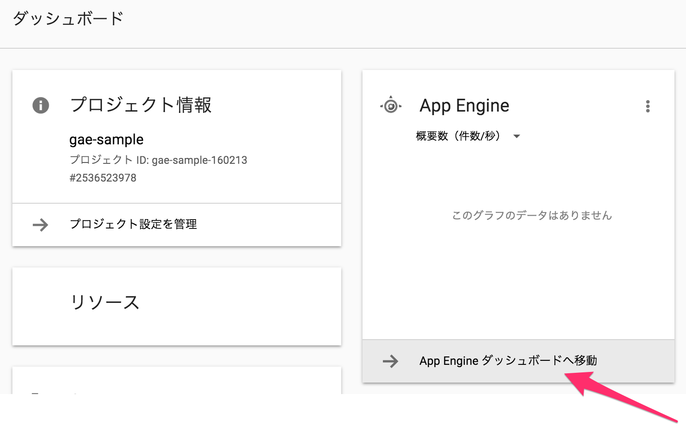
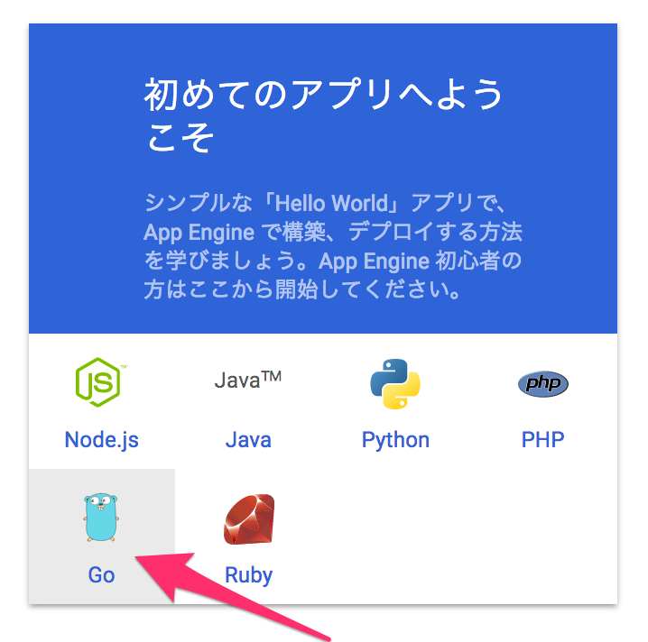
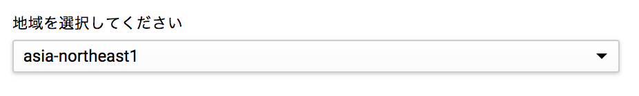

# See
https://cloud.google.com/appengine/docs/standard/go/tools/uploadinganapp


# Precondition
The project has already been created.

# Setting project for App Engine 





# Deploy

```test
goapp deploy [project_directory]
```

## Token file is created
```
~/.appcfg_oauth2_tokens
```
